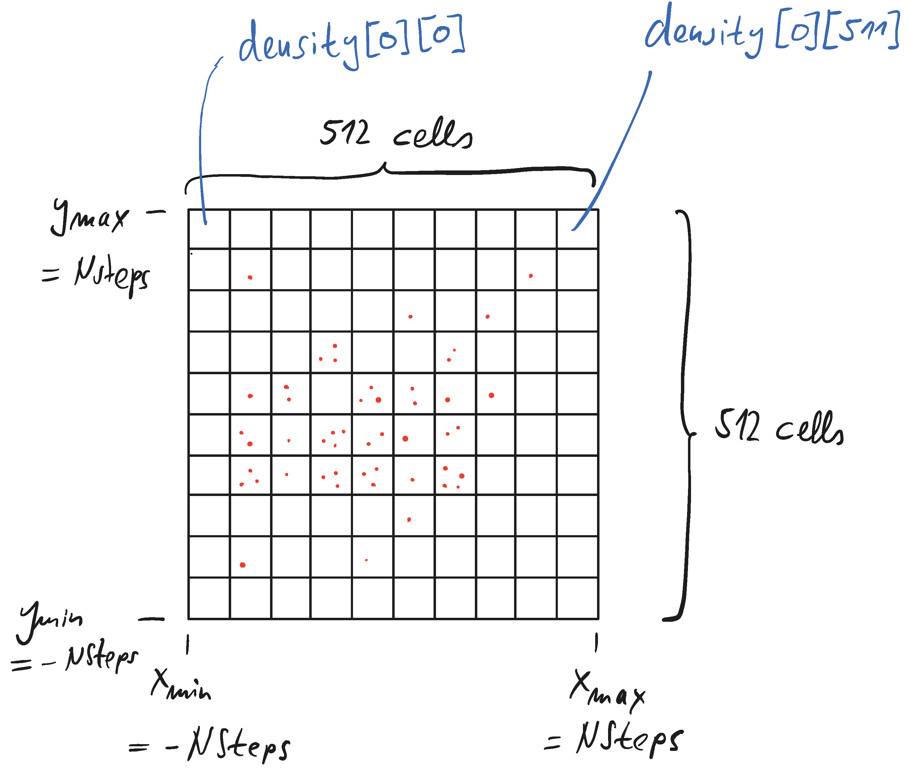

# Lab 5

This lab is a continuation of lab 4. Our starting point is the example solution to lab 4.

## Step 1

Read the existing code. Compile & run the code. Check out the files it generates
(Note the file size).

You can animate the output in gnuplot by using a for-loop inside gnuplot:
```
set xr[-40:40]
set yr[-40:40]
do for [t=0:20] { plot "rwalk_".t  }
```

## Step 2

One thing that we would like to improve in our program is the output of the particles
positions. At the moment the code writes the positions at intermediate times into a
plain text file. 

* Question: How many digits of *x* and *y* are shown in the text file? How many
digits does the data type `double` offer?

Clearly, the positions in the file are not as precise as they could be.
The precision of an output stream can be set via `setprecision()` which
is declared in `#include <iomanip>`.

Example:
```C++
#include <iostream>     // std::cout, std::fixed
#include <iomanip>      // std::setprecision

int main () {
  double f =3.14159;
  std::cout << std::setprecision(5) << f << '\n';
  std::cout << std::setprecision(9) << f << '\n';

  // Setting the precision once and forever
  std::cout << std::setprecision(6);
  std::cout << f << '\n';
  return 0;
}
```
* Modify the output such that the particle positions are printed to the file
with the maximum number of digits.
* Check the file size. Of course the files are now larger.

Instead of using text files, we can write the data in a binary file.
The file size is easily predicted as every `double` takes 8 bytes: *Nparticles * 2 * 8 bytes*. 

To directly write data from memory to a file, we use the `write` method of the
`ofstream` class. This method takes two parameters: A pointer `p` (of type `char*`)
to our data and the number `n` of bytes we want to write to the file. The following
code exemplifies this:
```C++
#include <fstream>

using namespace std;

typedef struct{
   double x, y;
} particle;

int main(){
    // NEW: initialization of struct upon creation!
    particle p = {.x =1, .y=0.1};
    ofstream out("out.bin", ios::binary);
    out.write((char*)&p, sizeof(particle) );
    out.close();
}
```
Th expression `(char*)&p` takes the pointer to the struct `p` (which is of
type `particle*`) and converts it into a `char*` (which is required by `write`).
The `sizeof(particle)` command determines the number of bytes necessary to store a
single particle (i.e. we do not explicitly have to know how much memory is required).

* Implement a second output function `write_to_file_binary(..)` that writes out the
data as binary format.

* Gnuplot can handle binary files, however, we will now have to help gnuplot to
interpret the files. Plot the files via
```
p "rwalk_10" binary format='%lf%lf'
```
The format definition '%lf%lf' indicates that always two double (in gnuplot language
*lf = long float*) belong to one data point. If we had used *float* for `x` and `y` in `particle`, the format would be format='%f%f'.

## Step 3

After several time steps (set by the variable `Nsteps` in the example
solution) the *N* particles are distributed in the *(x,y)*-plane. So far,
we treat every particle as point-like. Still, we can calculate a particle
density. For this, we divide the *(x,y)*-plane into a grid and count the
number of particles in every cell. It is this density that we would like
to plot in GNUplot as a pseudo-color image.

The idea is to create a (**statically** allocated) two-dimensional
array of size 512 x 512, 
where every entry stands for the density in one cell of the grid.
The *x* (and *y*) interval the grid has to cover depends on the number of
time steps we have calculated. Since the particle can advance a length of 1
per time step, after `Nsteps` time steps the *x* (and *y*) coordinates of
all particles must be in the range of *[-Nsteps,NSteps]*. The spatial
dimension of
one grid cell immediately follows from this interval length and the number of
cells.

<p align="center">

</p>

* Allocate the two-dimensional array that stores the matrix entries
  in the main program (using `int density[512][512]`).
* A static 2D array is initialized and passed into a function as follows:
```C++
int density[512][512] = {0};

f(density);
...
void f(int density[][512]){...}
```

* Write a function `calc_density(...)` that you call at the end of the 
  simulations that takes the array of particles and determines 
  for every cell of the grid the number of particles within the cell.
* Write a function `write_density(...)` that writes the entries of the matrix
into a file. Write on entry per line, along with the coordinate of
the cell center, i.e.
```
x0    y0   density[0][0]
x1    y0   density[0][1]
...
x511  y0   density[0][511]

x0    y1   density[1][0]
x1    y1   density[1][1]
...
x511  y1   density[1][511]

...
```
Note the extra empty line between blocks of different *y* values.
This data you can plot `plot 'datafile.txt' w image` in gnuplot or
via `splot`:
```
splot 'datafile.txt' w pm3d
```
